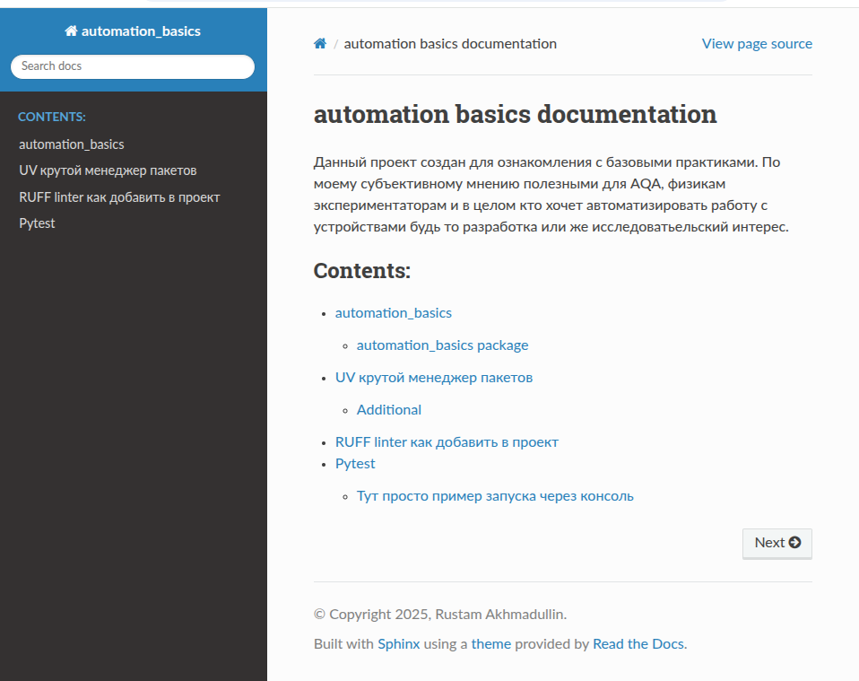

# automation tutorial 
## intro 
Данный проект создан для ознакомления с базовыми практиками. По моему субъективному мнению полезными для AQA, физикам экспериментаторам и в целом кто хочет автоматизировать работу с устройствами будь то разработка или же исследовательский интерес. 

## Генерация документации

Для генерации rst файлов из исходников питонячих скриптов 

```bash 
uv run poe api-rst
```
Для того чтобы из этой заготовки получить html страницы 
```bash 
uv run poe html
```

Далее открываем в браузере [точку входа](docs/source/index.rst)



## Генерация pdf файла

```bash 
uv run poe pdf
```
все сгенерится в папке
```bash
(automation-basic) rustam@rustam-zenbook:~/Documents/automation_basic$ tree -L 2  docs/build/
docs/build/
├── doctrees
│   ├── api
│   ├── environment.pickle
│   ├── index.doctree
│   ├── modules.doctree
│   └── tutorials
└── simplepdf
    ├── automation_basics.pdf
    ├── index.html
    ├── objects.inv
    └── _static

```

